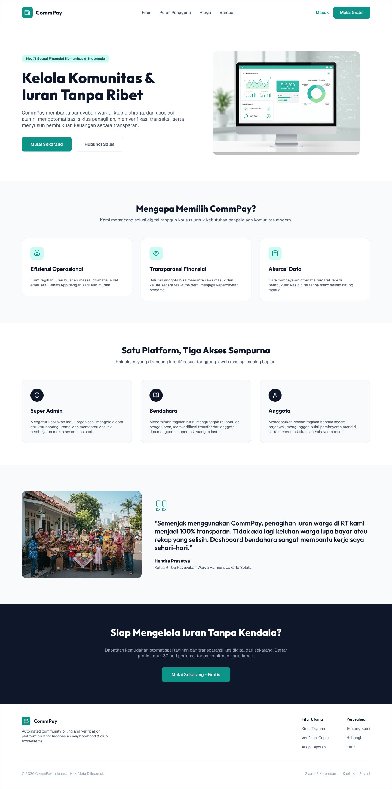
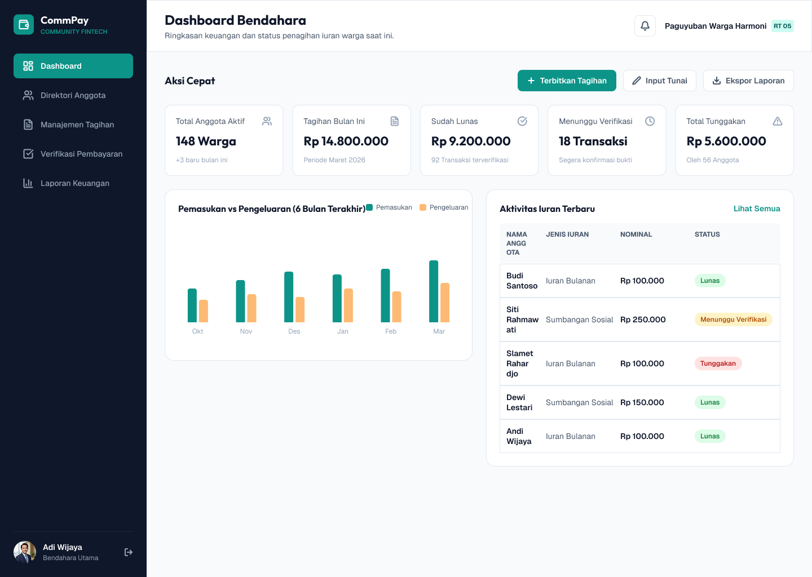
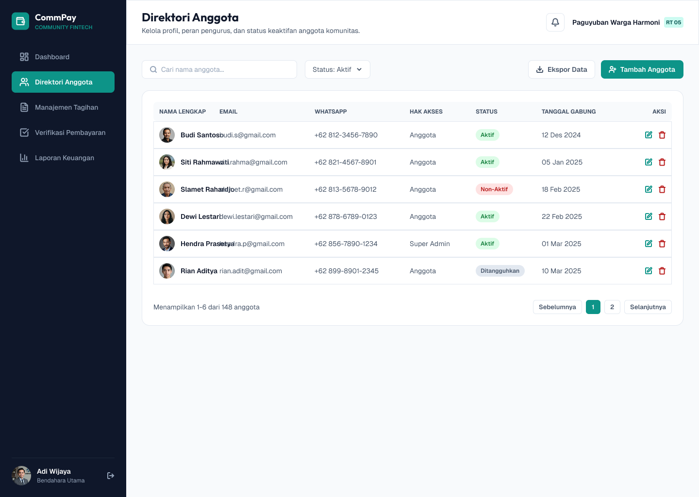
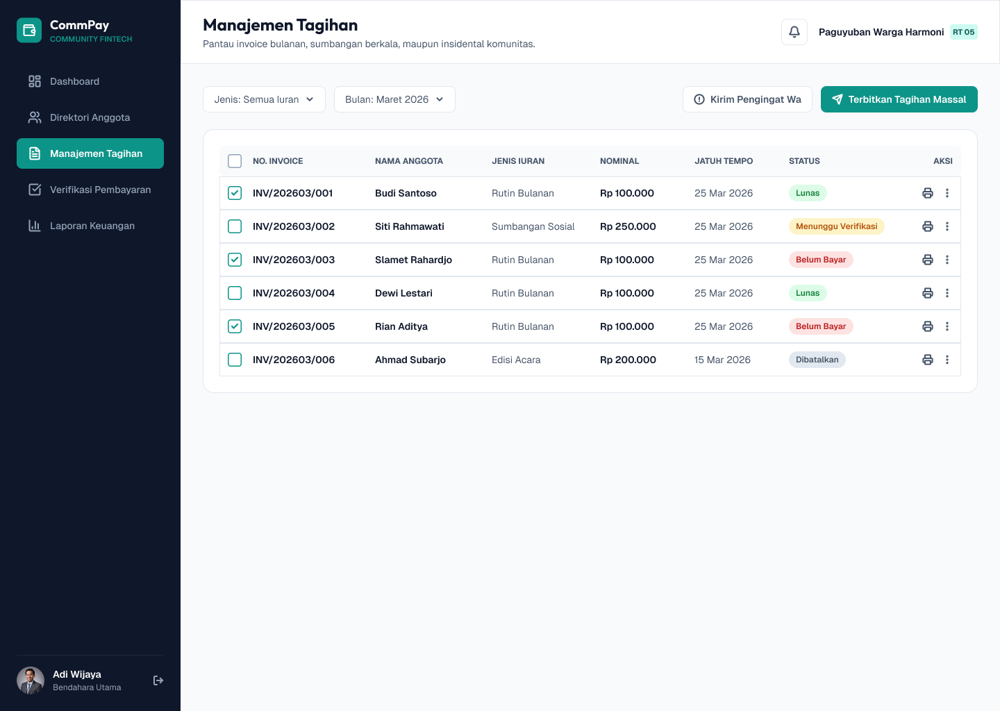
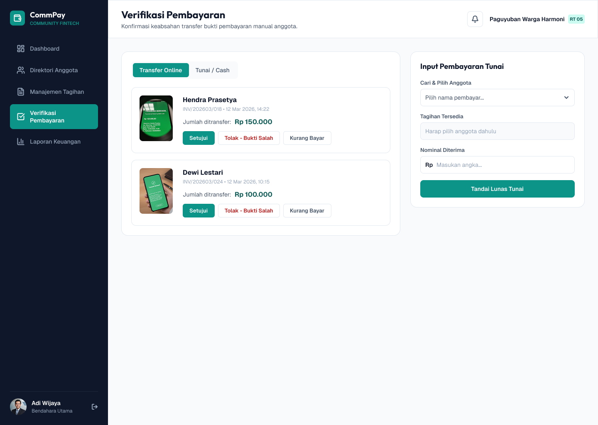
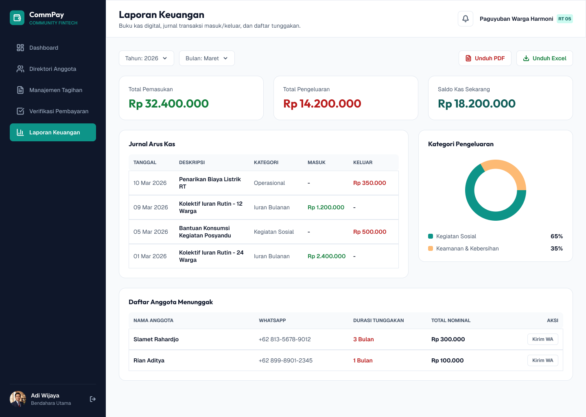

<p align="center">
    
</p>

<h1 align="center">CommPay</h1>

<p align="center">
    <strong>Community Fintech — Kelola Komunitas & Iuran Tanpa Ribet</strong>
</p>

---

## Tentang

CommPay adalah platform fintech komunitas yang membantu paguyuban warga, klub olahraga, asosiasi alumni, koperasi, dan komunitas lainnya mengotomatisasi siklus penagihan, memverifikasi transaksi, serta menyusun pembukuan keuangan secara transparan.

Bukan hanya untuk kas RT — CommPay dirancang general untuk komunitas apa pun yang mengelola iuran dan kas bersama: tagihan terbit otomatis, bukti pembayaran terverifikasi, dan kuitansi resmi terbit untuk setiap pembayaran.

## Tangkapan Layar

| Landing Page | Dashboard Bendahara |
| :---: | :---: |
|  |  |

| Direktori Anggota | Manajemen Tagihan |
| :---: | :---: |
|  |  |

| Verifikasi Pembayaran | Laporan Keuangan |
| :---: | :---: |
|  |  |

## Fitur

- **Dashboard Bendahara** — ringkasan keuangan: anggota aktif, tagihan bulan berjalan, lunas, menunggu verifikasi, dan tunggakan + grafik pemasukan vs pengeluaran (ECharts)
- **Direktori Anggota** — kelola profil, hak akses, dan status keaktifan anggota; pencarian, filter, dan ekspor data
- **Manajemen Tagihan** — pantau invoice rutin bulanan, sumbangan, dan tagihan insidental; terbitkan tagihan massal & kirim pengingat WhatsApp
- **Verifikasi Pembayaran** — konfirmasi bukti transfer anggota (setujui / tolak / kurang bayar) + input pembayaran tunai
- **Laporan Keuangan** — buku kas digital, jurnal arus kas, komposisi kategori pengeluaran (donut chart), dan daftar anggota menunggak

## Peran Pengguna

| Peran | Tanggung Jawab |
| :--- | :--- |
| **Super Admin** | Kebijakan induk organisasi, struktur cabang, analitik pembayaran lintas komunitas |
| **Bendahara** | Terbitkan tagihan, verifikasi transfer, catat pengeluaran, unduh laporan keuangan |
| **Anggota** | Lihat tagihan berkala, unggah bukti bayar, terima kuitansi resmi, pantau kas |

## Teknologi

- [Laravel 13](https://laravel.com) · PHP 8.3+
- Tailwind CSS 4 + Flowbite · Vite 8
- Apache ECharts untuk visualisasi grafik
- Pest 5 untuk testing
- MySQL

## Instalasi

```bash
# 1. Install dependency
composer install
npm install

# 2. Konfigurasi environment
cp .env.example .env
php artisan key:generate

# 3. Database (default .env memakai MySQL MAMP)
#    DB_PORT=8889, DB_USERNAME=root, DB_PASSWORD=root
php artisan migrate

# 4. Build frontend
npm run build
```

## Menjalankan

```bash
# Artisan + Vite sekaligus (hot reload)
composer run dev

# Atau artisan saja
php artisan serve --host=0.0.0.0 --port=8000

# Test
composer test

# Format PHP yang berubah (butuh git)
vendor/bin/pint --dirty --format agent
```

## Status Proyek

- [x] Landing page, login, register
- [x] Dashboard Bendahara, Direktori Anggota, Manajemen Tagihan, Verifikasi Pembayaran, Laporan Keuangan
- [ ] Autentikasi penuh (saat ini stub — menunggu model data sesuai PRD)
- [ ] Integrasi database & role-based access

## Lisensi

[MIT](LICENSE)
